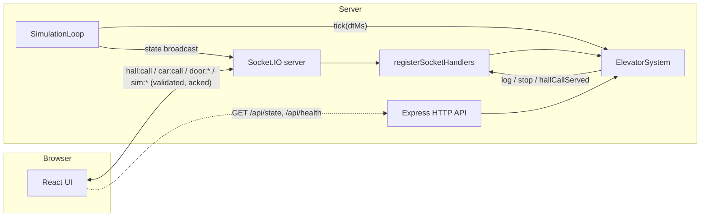
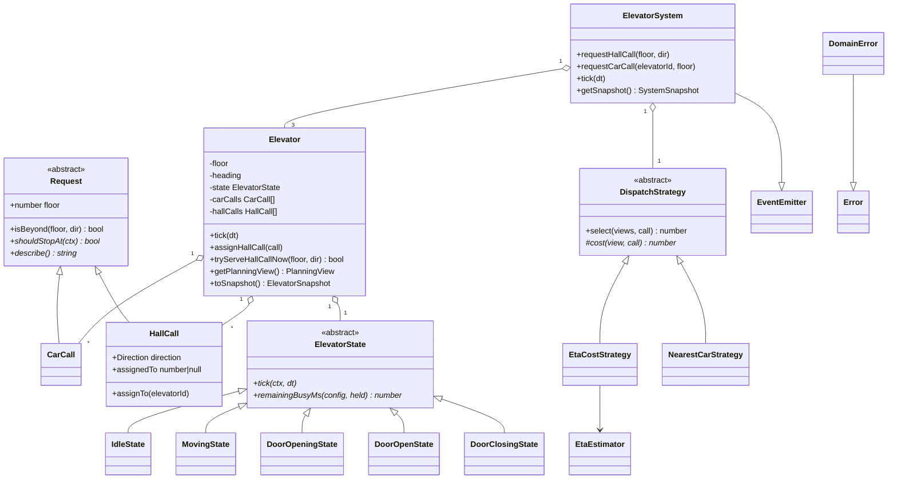
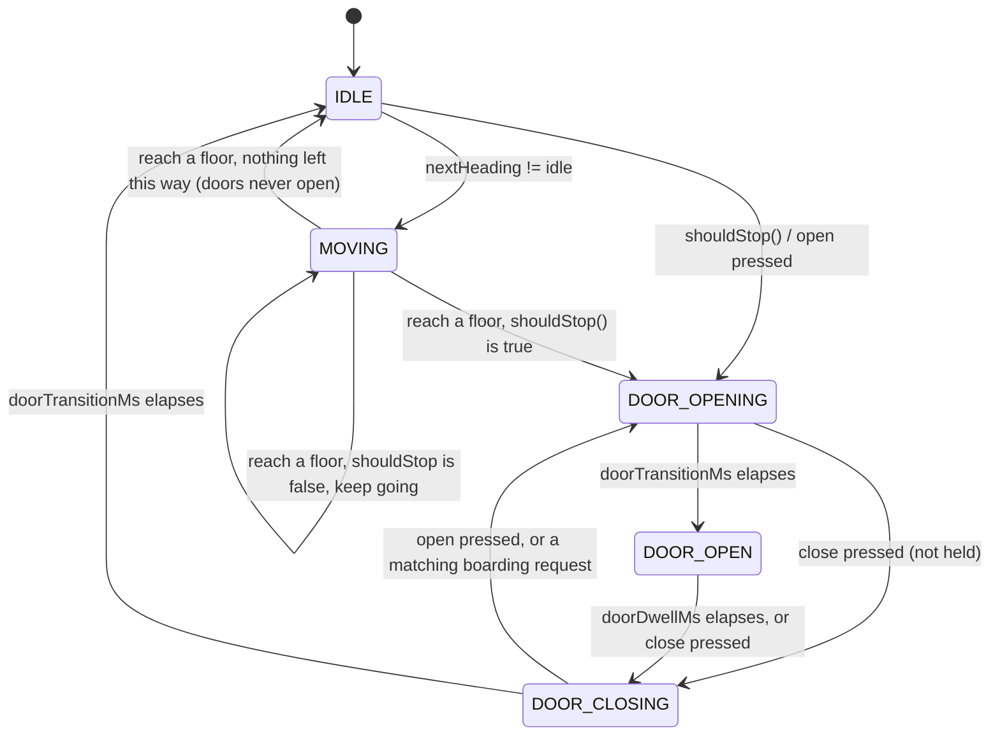

# Elevator Simulator

A web-based simulator for 3 elevators serving 10 floors, built to demonstrate an efficient, explainable
dispatch strategy under a directional (LOOK-style) collective-control scheme. The backend owns one shared,
authoritative simulation; every connected browser tab sees the same state over Socket.IO.

## Quick start

```bash
npm install
npm run dev        # http://localhost:5173 (Vite dev server, proxies API/WS to :3001)
```

Production build:

```bash
npm run build
npm start          # http://localhost:3001 (Express serves the built UI and the API)
```

## How to use

| Control                                      | Rule from the brief                                                                                                                                                                                                                   |
| -------------------------------------------- | ------------------------------------------------------------------------------------------------------------------------------------------------------------------------------------------------------------------------------------- |
| ▲ / ▼ hall buttons (each floor, each column) | Calls the nearest/cheapest elevator to that floor. The button lights up in **all three** columns (the call is shared, not per-column); the assigned elevator's column also gets an outline ring. Floor 1 has no ▼, floor 10 has no ▲. |
| Floor number boxes inside a column           | Choose a destination once that elevator's doors are open (or opening/closing) — i.e. while it's _boarding_. Clicking the elevator's own current floor is a no-op.                                                                     |
| ▶◀ (close)                                   | Click to close the doors immediately.                                                                                                                                                                                                 |
| ◀▶ (open)                                    | **Press and hold** to keep the doors open; release to let them close after the normal dwell time. Auto-releases after 20s so a stuck button can't wedge the car open forever.                                                         |
| Red-bordered floor box                       | Shows which floor that elevator is currently at.                                                                                                                                                                                      |
| Strategy / Speed selectors                   | Swap the live `DispatchStrategy` (ETA-based vs. nearest-car) or the simulation speed (1×/2×/5×) without resetting.                                                                                                                    |

## Assumptions

| #   | Decision                                                                                                                                                                                                                                                                                                                                                 |
| --- | -------------------------------------------------------------------------------------------------------------------------------------------------------------------------------------------------------------------------------------------------------------------------------------------------------------------------------------------------------- |
| 1   | Hall calls belong to the **floor**, not to a column. Pressing ▲ on floor 5 is the same request no matter which column you clicked it in.                                                                                                                                                                                                                 |
| 2   | Each hall call is assigned **once**, at creation, by the active dispatch strategy — except for two escape hatches: _boarding extension_ (an elevator already open at that exact floor takes it immediately) and _opportunistic service_ (an elevator that happens to stop there anyway, e.g. for a car call, steals it from whoever it was assigned to). |
| 3   | Car calls (destinations) are only accepted while that elevator is boarding (doors opening, open, or closing).                                                                                                                                                                                                                                            |
| 4   | Door buttons act on that column's own elevator, only while it's stationary at that floor.                                                                                                                                                                                                                                                                |
| 5   | Stopping and re-heading decisions follow directional collective control (LOOK): a moving car only stops for a hall call going its own way, unless that floor is the turnaround point.                                                                                                                                                                    |
| 6   | **No capacity/weight/passenger-count modeling** in the simulation domain — only hall calls and car calls.                                                                                                                                                                                                                                                |
| 7   | The server is authoritative — one simulation, shared by every client.                                                                                                                                                                                                                                                                                    |
| 8   | All elevators start at floor 1, idle, doors closed.                                                                                                                                                                                                                                                                                                      |
| 9   | Default timings: 1500ms/floor, 1000ms door open/close, 3000ms dwell, 20000ms max door hold, 100ms tick.                                                                                                                                                                                                                                                  |

## Architecture



The domain (`apps/server/src/domain/**`) is deliberately pure: no imports from `express`/`socket.io`/`node:http`,
no `setTimeout`/`Date.now()`. Time only advances through `tick(dtMs)`, called by `SimulationLoop` on a
100ms `setInterval` (scaled by the speed multiplier). That single choice keeps the whole domain layer
deterministic and easy to reason about — the same `tick(dtMs)` call is what drives both real time in
production and any speed multiplier in the UI, with no other code path that mutates simulation state.

## Domain model and OOP



| Principle           | Where                                                                                                                                                                                                                                                                                                                                                                                                                                                                                                                                                                                                                                                                                                      |
| ------------------- | ---------------------------------------------------------------------------------------------------------------------------------------------------------------------------------------------------------------------------------------------------------------------------------------------------------------------------------------------------------------------------------------------------------------------------------------------------------------------------------------------------------------------------------------------------------------------------------------------------------------------------------------------------------------------------------------------------------- |
| **Encapsulation**   | [`Elevator`](apps/server/src/domain/elevator/Elevator.ts) keeps `floor`, `heading`, `state`, `carCalls`, `hallCalls` and `held` private, reachable only through intent methods (`assignHallCall`, `addCarCall`, `pressDoorOpen`, …). States never touch those fields directly — they get a narrow [`ElevatorContext`](apps/server/src/domain/elevator/ElevatorContext.ts) capability object instead of the whole elevator. [`HallCall.assignee`](apps/server/src/domain/requests/HallCall.ts) is private and changes only via `assignTo()`. Snapshots (`toSnapshot()`, `getPlanningView()`) hand out copies, never internal arrays.                                                                        |
| **Inheritance**     | [`Request`](apps/server/src/domain/requests/Request.ts) → [`CarCall`](apps/server/src/domain/requests/CarCall.ts) / [`HallCall`](apps/server/src/domain/requests/HallCall.ts). [`ElevatorState`](apps/server/src/domain/elevator/states/ElevatorState.ts) → 5 concrete states in the same folder. [`DispatchStrategy`](apps/server/src/domain/dispatch/DispatchStrategy.ts) → [`EtaCostStrategy`](apps/server/src/domain/dispatch/EtaCostStrategy.ts) / [`NearestCarStrategy`](apps/server/src/domain/dispatch/NearestCarStrategy.ts). [`ElevatorSystem`](apps/server/src/domain/ElevatorSystem.ts) extends Node's `EventEmitter`. [`DomainError`](apps/server/src/domain/DomainError.ts) extends `Error`. |
| **Polymorphism**    | `request.shouldStopAt()` — the brief's direction rule lives entirely in `HallCall`'s override; `CarCall` always stops. `state.tick()` / `state.onDoorOpenPressed()` / etc. behave differently per state with no `if (state === ...)` branching anywhere else in the codebase. `strategy.cost()` is swappable at runtime from the UI. `state.remainingBusyMs()` feeds the ETA estimator without it knowing which state it's asking.                                                                                                                                                                                                                                                                         |
| **Design patterns** | **State** (elevator lifecycle), **Strategy + Template Method** (`DispatchStrategy.select()` is the template, `cost()` is the hook), **Facade** (`ElevatorSystem` is the single entry point transport code talks to), **Observer** (`EventEmitter` → Socket.IO bridges domain events to the wire).                                                                                                                                                                                                                                                                                                                                                                                                          |

## Scheduling: directional collective control (LOOK)

[`RoutePlanner`](apps/server/src/domain/scheduling/RoutePlanner.ts) holds the three pure rules shared by both
the elevator's own state machine and the ETA estimator, so "will it stop here" is answered identically whether
the elevator is really moving or just being simulated for a cost estimate:

- **`shouldStop(route)`** — should the elevator open its doors at this floor, given its current heading?
- **`headingAtStop(route)`** — once stopped, which direction does it commit to (decides which of a same-floor
  ▲/▼ pair gets served)?
- **`nextHeading(route)`** — which way does it travel next?

The brief's own example, walked through against the actual code:

> Elevator heads up from 1 towards a car call at 10. Floor 5 has both ▲ and ▼ pending.

1. **At floor 5, heading up.** `HallCall(5, up).shouldStopAt()` → true (same direction). `HallCall(5, down)`
   alone would return **false**, because something (the car call at 10) is still beyond floor 5 going up —
   exactly the brief's rule. `headingAtStop` stays `up`, so 5▲ is the one served here.
2. **At floor 10.** The car call stops it. `headingAtStop` finds nothing ahead and 5▼ still beyond going
   down, so the heading flips to `down`.
3. **Back at floor 5, heading down.** `HallCall(5, down).shouldStopAt()` → true, served.



## Dispatch: why ETA beats nearest-car

[`NearestCarStrategy`](apps/server/src/domain/dispatch/NearestCarStrategy.ts) costs a car by raw floor
distance (penalized if it's moving away). It's cheap and intuitive, but blind to what the car is _already
committed to_. [`EtaCostStrategy`](apps/server/src/domain/dispatch/EtaCostStrategy.ts) instead runs
[`EtaEstimator`](apps/server/src/domain/scheduling/EtaEstimator.ts), which **replays the elevator's actual
future route** — using the exact same `RoutePlanner` rules the real elevator obeys — with the new call
appended, and returns the simulated time until its doors would open for that call.

The headline example: elevator **A** is at floor 3, already moving up with three car calls ahead (4, 5, 6);
elevator **B** is idle at floor 1. A hall call arrives at floor 7 (▲).

- **Raw distance:** A is 4 floors away, B is 6 — nearest-car picks **A**.
- **Reality:** A has to serve 4, 5 and 6 first (three more door cycles) before it can even continue toward
  7; B can go there directly. ETA-based costing picks **B**, and it's the one that actually arrives first.

**Pricing in collateral delay.** A raw ETA number isn't the whole story either: an elevator already mid-route
can look artificially cheap for a *new* call simply because it happens to be passing by right now — while the
LOOK rules mean it would have to skip straight past a hall call it already promised (something is still
"beyond" it in its travel direction), badly delaying that other passenger. `EtaCostStrategy` also measures,
for every hall call the candidate elevator already holds, how much *extra* wait this new assignment would
add to it (`estimateMs` with vs. without the new call in the mix) and prices that straight into the cost,
on top of a small flat `stopPenaltyMs × (pending stops)` term. Concretely: 3 idle elevators sit at floor 10;
hall calls arrive at floors 3, then 2, then 1 (▲ each), a few seconds apart. Elevator 1 takes the call at 3
and starts down. Elevator 2 takes 2. By the time the call at 1 arrives, elevator 1 — now mid-flight and
close to the bottom — has a *lower raw ETA* to floor 1 than idle elevator 3 has, purely from having a head
start. But serving it would force elevator 1 to sail past its own floor-3 passenger (adding roughly a full
door cycle's worth of delay, ~5s, to their wait) — so it's priced accordingly, and idle elevator 3 correctly
wins instead. All three elevators end up used, exactly as they should.

Two extra rules keep the dispatcher honest without needing continuous re-dispatch:

- **Boarding extension** — if a hall call's own elevator is already open at that exact floor and heading
  the right way, it's served immediately (`waitMs: 0`), skipping the strategy entirely.
- **Opportunistic service** — if some _other_ elevator happens to stop at that floor anyway (e.g. for one of
  its own car calls) before the assignee gets there, it serves the call on the spot and the original
  assignment is silently dropped.

## Trade-offs and future work

- **Assign-once vs. continuous re-dispatch.** Calls are assigned once at creation (plus the two escape
  hatches above). A periodic re-evaluation of pending assignments as elevators become idle would shave a
  little more off worst-case wait but adds real complexity and its own testing surface — left for later.
- **No capacity model.** Real elevators fill up; this one never rejects a passenger for being full. Adding
  it would mean threading a passenger/weight count through `HallCall`/`CarCall` and the dispatch cost.
- **Lobby parking in up-peak.** Idle elevators don't proactively return to floor 1 between up-peak bursts;
  they just wait wherever they last stopped.
- **Horizontal scaling.** The simulation is a single in-memory `ElevatorSystem` per server process. Multiple
  server instances would need the state (and the tick loop) moved to something shared, e.g. Redis plus a
  single elected tick owner.
- **Destination dispatch.** Real modern installations ask for a destination floor at the hall call itself
  (not just direction), which lets the dispatcher group passengers more precisely than an up/down button
  ever can.

## Project structure

```
elevator-simulator/
├─ packages/shared/           # @elevator/shared — types, constants, config, zod schemas, socket contracts
├─ apps/server/                # @elevator/server
│  └─ src/
│     ├─ domain/               # pure simulation core (no I/O, no timers) — see the OOP map above
│     ├─ engine/                # SimulationLoop: the only thing that calls tick() on a timer
│     └─ transport/            # Express + Socket.IO wiring, validation, hold-button tracking
└─ apps/web/                   # @elevator/web — React UI
   └─ src/
      ├─ hooks/useSimulation.ts # the one socket connection; exposes state + typed actions
      └─ components/            # Toolbar, ElevatorBank → ElevatorShaft → FloorRow → {HallButtons, CarDoor, DoorButtons}
```
